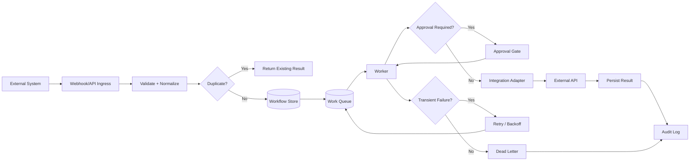
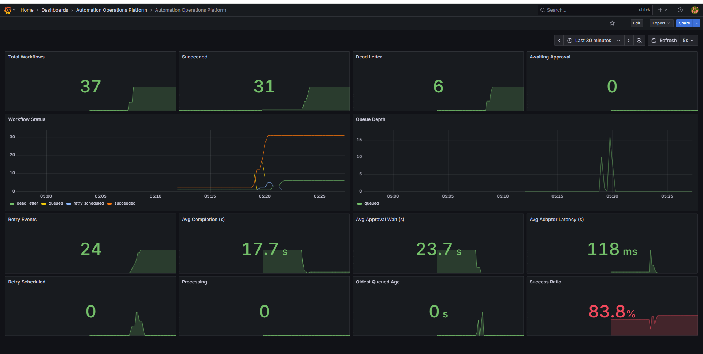

# Automation Operations Platform

A public reference implementation for reliable API- and webhook-driven operations workflows.

The project demonstrates how to accept inbound work, normalize it, enforce idempotency, queue it safely, route high-risk actions through human approval, retry transient failures, and preserve an audit trail from request to completion.

## What This Project Demonstrates

- Webhook ingestion
- Idempotency and deduplication
- Queue-based work dispatch
- Explicit workflow state
- Retry and backoff strategy
- Human approval gates
- Adapter-based external integrations
- Audit logging
- Dead-letter handling
- Operational observability
- Environment-based secret management

## Reference Architecture



## Workflow State Model

A durable workflow should move through explicit states rather than relying on implicit control flow.

```text
received
  ↓
validated
  ↓
queued
  ↓
processing
  ├──→ awaiting_approval
  │       ↓
  │    approved
  │       ↓
  ├──── processing
  ↓
succeeded

processing
  ├──→ retry_scheduled
  ├──→ failed
  └──→ dead_letter
```

## Repository Layout

```text
automation-operations-platform/
├── docs/
│   ├── architecture.md
│   ├── idempotency.md
│   ├── retries.md
│   └── approvals.md
├── database/
│   └── schema.sql
├── src/
│   ├── domain/
│   │   └── workflow.ts
│   ├── ingress/
│   │   └── webhook-handler.ts
│   ├── queue/
│   │   └── dispatcher.ts
│   └── adapters/
│       └── mock-adapter.ts
├── examples/
│   └── webhook.example.json
├── .env.example
├── .gitignore
└── README.md
```

## Design Principles

**Idempotent by default**  
Repeated delivery of the same event should not create duplicate work.

**State is explicit**  
Workflow progress is persisted rather than inferred from logs.

**External APIs are isolated**  
Provider-specific code stays inside adapters.

**Retries are selective**  
Transient failures may retry. Validation failures and permanent business-rule failures should not.

**Approvals are first-class state**  
Human review is part of the workflow model, not an out-of-band email thread.

**Auditability matters**  
Every meaningful transition should be reconstructable later.

**Secrets stay out of source control**  
Credentials belong in environment variables or a secret manager.

## Example Flow

1. Receive a webhook.
2. Validate its signature and payload.
3. Compute or read an idempotency key.
4. Return the existing workflow if already seen.
5. Persist a new workflow record.
6. Queue work.
7. Execute via an integration adapter.
8. Pause for approval when required.
9. Retry transient failures with bounded backoff.
10. Persist the final result and audit events.

## Production vs. Public Reference

This is a portfolio-safe implementation. It does not contain production credentials, customer data, proprietary business logic, private webhook URLs, or commercial workflow configuration.

## Run It Locally

```powershell
docker compose up -d --build
```

The Docker stack starts PostgreSQL, the API, and a background worker.

- [Local end-to-end demo](docs/local-demo.md)
- [Validated runtime evidence](docs/validation-evidence.md)
- [Local observability demo](docs/observability-demo.md)

The demo has been exercised through success, duplicate/idempotent delivery, human approval, transient retry, dead-letter handling, audit history, and live workflow metrics.


## Runtime Observability Dashboard



The local reference stack includes Prometheus metrics and a provisioned Grafana dashboard showing workflow totals, success and dead-letter counts, retries, queue depth, approval wait, adapter latency, and success ratio.

## Planned Enhancements

- Webhook signature verification examples
- Rate-limit-aware retry policy
- Correlation IDs
- OpenTelemetry examples

## Validation

This reference implementation is checked in GitHub Actions. CI runs the TypeScript test suite and strict type-checking on pushes and pull requests to `main`.

## Architecture Deep Dive

- [Case study](docs/case-study.md)
- [Architecture decisions](docs/adr/README.md)
- [Reliability and recovery](docs/reliability-recovery.md)

## Operations Deep Dive

- [Observability and service signals](docs/observability.md)
- [Incident runbook](docs/runbook.md)
- [Example incident scenario](docs/incident-scenario.md)
- [Metrics catalog](examples/metrics-catalog.json)

## Production Automation Experience

The reference architecture is informed by a larger Make-based automation estate with live publishing, AI-generation, media-production, API-shell, synchronization, approval, and audit workflows.

- [Make orchestration case study](docs/make-orchestration-case-study.md)
- [AI-assisted content pipeline case study](docs/ai-content-pipeline-case-study.md)
- [Sanitized orchestration pattern catalog](examples/orchestration-patterns.json)

## Cross-Platform Workflow Engineering

- [Make vs. TypeScript dispatcher](docs/make-vs-code-dispatcher.md)
- [AI workflow engineering: Notion + ChatGPT + Claude + Make](docs/ai-workflow-engineering.md)

## Workflow Engineering Experience

- [Production workflow patterns](docs/production-workflow-patterns.md)
- [Visual orchestration vs. typed workflow services](docs/visual-orchestration-vs-code.md)
- [Interview guide](docs/interview-guide.md)


## Infrastructure as Code

A reference AWS deployment is defined in [deploy/terraform/aws](deploy/terraform/aws).

It demonstrates:

- VPC and subnet design
- Application Load Balancer
- ECS/Fargate API and worker services
- private RDS PostgreSQL
- ECR image repository
- CloudWatch logging
- Secrets Manager-backed database credentials
- one-off database migration task
- Terraform CI validation

The Terraform is intended to be reviewed and planned safely before any deployment. Running `terraform apply` would create billable AWS resources.


## Deployment Options

This repository now demonstrates two deployment layers:

### Production-style Docker

[Production Docker guide](docs/production-docker.md)

The hardened Compose stack demonstrates:

- multi-stage builds
- compiled JavaScript runtime
- non-root application containers
- health checks and restart policies
- externalized credentials
- read-only application filesystems
- reduced Linux capabilities
- internal database networking

### AWS Infrastructure as Code

[AWS Terraform reference deployment](deploy/terraform/aws/README.md)

The Terraform layer maps the same application roles to ECS/Fargate, RDS PostgreSQL, ECR, an Application Load Balancer, CloudWatch, and Secrets Manager-backed database credentials.
