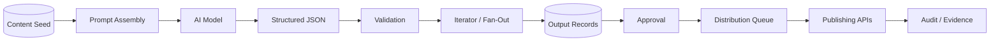

# Case Study: AI-Assisted Content Production Pipeline

## Context

A second body of work combines structured source data, AI generation, validation, iteration, durable storage, and publishing automation.

This is represented here as an **AI scripting/content-generation pipeline** rather than a brand-specific implementation.

## Generalized Flow

## Engineering Patterns

### Prompt inputs come from data

Prompts are assembled from structured source records such as:

- content seed
- audience or channel profile
- voice rules
- format constraints
- prior approved material

This avoids burying business rules in an unversioned prompt string.

### Structured output contracts

AI responses are required to conform to a known JSON structure before downstream automation proceeds.

### Parse before act

Generated content is parsed and validated before it is allowed to create publishing or delivery actions.

### Fan-out after validation

One approved source can generate multiple channel-specific outputs through iterators or worker calls.

### Raw evidence retention

Where useful, the system can preserve:

- prompt input
- raw model response
- parsed output
- generation run identity
- validation result
- downstream record IDs

That makes failures explainable.

### Human review remains available

Automation can generate and prepare content while keeping high-impact publication decisions behind explicit approval.

## Failure Modes

Common failure classes include:

- missing source fields
- malformed JSON
- output count mismatch
- unsupported database enum/state
- provider timeout
- downstream API rejection
- duplicate generation
- partially completed fan-out

The workflow should classify these rather than retry every failure indiscriminately.

## Why This Belongs in an Engineering Portfolio

The interesting part is not that AI generated text.

The engineering work is the **control plane around the model**:

- contracts
- state
- validation
- routing
- persistence
- retries
- approvals
- evidence
- downstream integrations

That is the difference between "using an AI tool" and operating an AI-enabled workflow.
