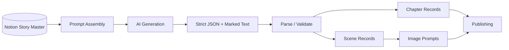

# AI Workflow Engineering: Notion + ChatGPT + Claude + Make

This portfolio work is not centered on a single AI model. It is an operating pattern that combines structured knowledge, prompt contracts, AI generation, state management, orchestration, review, and downstream delivery.

## The Tool Roles

### Notion — knowledge and design layer

Notion has been used to define:

- content schemas
- story/chapter/scene relationships
- prompt inputs and locked style/cast context
- marker grammars
- structured JSON output contracts
- production planning
- process documentation

One example used a single master AI script that emitted both strict JSON and deterministic marker-based text so the same generated artifact could support future automation and immediate formula-based parsing.

### ChatGPT — generation and transformation layer

ChatGPT has been used inside generation workflows where structured content is created from database-driven inputs.

A representative production-state design separates:

- source content state
- generation-run state
- generated-asset state
- distribution state

That separation prevents one status field from being overloaded across the entire pipeline.

### Claude — architecture, audit, and repair layer

Claude has been used for read-only audits, SQL-oriented repair work, workflow inspection, and architecture cleanup.

The value of using multiple models here is specialization: one model can be used for generation while another is used to inspect the surrounding system, critique workflow integrity, or support repair planning.

### Make — orchestration layer

Make coordinates:

- triggers
- polling or event-driven intake
- API calls
- iterators and routers
- async polling
- state updates
- approval gates
- publishing
- evidence writes

## Example: Structured Story Pipeline



The design intentionally locks style, character, topic, and scene context into the prompt inputs rather than relying on the model to remember them.

## Example: Process-State Separation

A mature AI workflow should distinguish:

```text
source content
generation attempt
generated asset
distribution attempt
```

Those are different lifecycle objects.

A source may be healthy while a generation attempt fails because configuration is missing.

An asset may be approved while one distribution attempt fails.

Separating those states makes retry and diagnosis much safer.

## Example State Families

### Source content
```text
draft → ready → processing → ai_complete → review → approved
```

### Generation run
```text
queued → processing → completed
                 ↘ failed → retry_waiting
                 ↘ blocked_needs_config
                 ↘ blocked_needs_data
```

### Generated output
```text
idea → draft → review → approved → scheduled → published
```

### Distribution
```text
pending → queued → processing → posted
                          ↘ failed
```

## Why This Matters

The deeper skill is not prompt writing.

It is designing the system around probabilistic generation:

- define contracts
- preserve provenance
- separate state domains
- validate before side effects
- make retries explicit
- distinguish bad data from bad configuration
- retain human gates where needed
- store evidence for later debugging
- use different AI tools for different jobs

That is AI workflow engineering rather than ad hoc AI usage.
