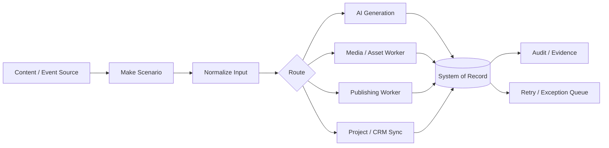

# Case Study: Make-Orchestrated Production Automation

## Context

This portfolio project is partly informed by a real Make-based automation estate used to coordinate publishing, content generation, media production, database updates, and external APIs.

The public documentation intentionally abstracts brand-specific data, credentials, webhook URLs, and commercial logic while preserving the architecture patterns.

## Observed Production Patterns

The connected Make workspace contains long-running and actively used scenarios including:

- a social publishing dispatcher with more than 1,800 executions
- a WordPress-to-social queue with more than 500 executions
- scheduled production workers with dozens of successful runs
- podcast generation, stitching, polling, archival, and publishing stages
- callable subscenarios with typed inputs and outputs
- API-shell scenarios for external SaaS systems
- database-backed synchronization into issue/project management
- public DNS verification and operational audit scenarios

These are not single-step zaps. They form a small integration platform.

## Architecture Pattern



## Design Techniques Used

### Scenario decomposition

Large workflows were split into callable workers rather than one giant scenario.

Examples of worker responsibilities include:

- intake
- generation
- asset production
- polling
- archival
- publishing
- synchronization
- audit

This limits blast radius and makes retries more targeted.

### Database-backed state

The system of record owns durable state while Make coordinates work.

That separation avoids treating a visual automation canvas as the canonical database.

### Typed scenario interfaces

Callable scenarios use explicit input/output contracts so orchestration can behave more like an API surface.

### Idempotency

Workflows use state checks, stable identifiers, existing-record checks, or database-enforced uniqueness to avoid repeating side effects.

### Human approval

High-impact publishing or production steps can wait for approval before downstream execution.

### Evidence and audit

Operational proof is written back to durable storage or audit channels rather than existing only in scenario execution history.

## Production Example: Publishing Queue

A generalized publishing path looks like:

```text
source content
  ↓
normalize
  ↓
create platform-specific queue rows
  ↓
validate readiness
  ↓
schedule through external publishing API
  ↓
persist external ID + outcome
  ↓
retry or flag exception
```

A production dispatcher based on this pattern has executed more than 1,800 times.

## Production Example: Media Pipeline

A generalized media flow looks like:

```text
approved script
  ↓
segment generation
  ↓
asset validation
  ↓
render/stitch dispatch
  ↓
poll asynchronous render
  ↓
archive
  ↓
publish metadata
  ↓
audit completion
```

The important architectural choice is that asynchronous media work is polled and persisted rather than assumed to finish inside one request.

## Production Example: Project Synchronization

A synchronization worker can:

1. claim one pending command
2. classify action such as create/update/close/reconcile
3. fetch canonical target state
4. perform the external API action
5. persist the external identifier
6. mark the command complete or retryable

This makes the integration recoverable and idempotent.

## Reliability Lessons

The real operational problems were rarely "Can API A call API B?"

They were:

- what happens if the API succeeds but the response is lost?
- how is duplicated input detected?
- how is a stuck asynchronous job recovered?
- which system owns truth?
- what can safely retry?
- where is evidence written?
- how do humans intervene without bypassing the workflow?

Those concerns directly informed the reference patterns in this repository.

## Portfolio Boundary

No production Make blueprint, connection identifier, credential, private endpoint, customer record, or proprietary content is included here.

The goal is to show the engineering pattern without publishing the production system.
