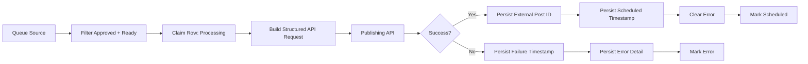

# Reference Implementation: Make Dispatcher vs. TypeScript

This example translates a real visual automation pattern into a typed implementation.

The original production pattern polls an approved publishing queue, claims eligible rows, builds a structured request for an external publishing API, routes success/failure, and writes evidence back to the queue.

The public version removes brand names, spreadsheet IDs, connection IDs, credentials, and private endpoints.

## Visual-Orchestration Version



## Typed-Code Version

The TypeScript implementation in:

```text
src/examples/social-dispatcher.ts
```

models the same behavior using interfaces:

- `PublishingQueue`
- `PublishingAdapter`
- `QueueItem`
- `dispatchNext()`

## Mapping

| Visual automation step | TypeScript equivalent |
|---|---|
| Filter rows | `queue.nextReady()` |
| Mark Processing | `queue.markProcessing()` |
| Build JSON | typed `PublishingRequest` |
| HTTP/GraphQL module | `adapter.schedule()` |
| Success router | result discriminant |
| Write external ID | `markScheduled()` |
| Error route | `markFailed()` |

## Why Build Both

Low-code orchestration is useful when:

- operators need visible flows
- SaaS connectors reduce integration cost
- workflows change frequently
- non-developers need to inspect or maintain steps

Typed code is useful when:

- logic becomes reusable across many workflows
- contracts need compiler enforcement
- tests must cover edge cases
- versioned deployment matters
- throughput or complexity outgrows a visual canvas

The engineering skill is not loyalty to either tool. It is understanding which layer owns state, how side effects are made safe, and where each representation is most maintainable.

## Production Lessons Reflected Here

The production dispatcher that inspired this example has run more than 1,800 times.

The most important design choices were:

1. claim work before sending
2. only select approved/ready work
3. persist the external result
4. persist failure evidence
5. make queue state visible to operators
6. avoid treating API acceptance as invisible success
