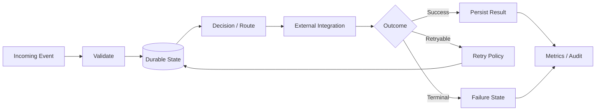

# Visual Orchestration vs. Typed Workflow Services

This project is designed to show that the same workflow architecture can be expressed through either a visual orchestration platform or a typed service.

## Conceptual Mapping

| Visual orchestration concept | Typed service equivalent |
|---|---|
| scenario trigger | webhook/API ingress |
| filter | validation / eligibility rule |
| router | branch / decision function |
| iterator | fan-out / worker loop |
| data store | durable database state |
| status writeback | explicit workflow transition |
| HTTP/SaaS module | integration adapter |
| retry handler | bounded retry policy |
| error route | failed / dead-letter state |
| manual approval | approval gate |
| execution history | workflow audit events |
| platform monitoring | metrics and dashboard |

## Architecture

## What Matters More Than the Tool

The core engineering questions are the same:

- Which system owns truth?
- How is duplicate work prevented?
- How is work claimed safely?
- Which failures are retryable?
- How are partial results preserved?
- When should a human approve execution?
- What evidence remains after completion?
- How does an operator know the system is healthy?

The implementation technology can change. The architecture principles remain transferable.
